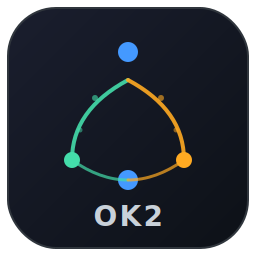

# OpenKeel v3

**Save 70% on Claude Code costs without losing quality.**

OpenKeel is a transparent token-saving layer for Claude Code. It sits between you and the API, automatically delegating cheap work to cheaper models (Haiku, local LLMs) while keeping Sonnet for the thinking that matters. You open it, launch Claude, and it just works — no workflow changes.



## What it does

- **Token Saver Hooks** — Intercepts Claude Code tool calls via the hooks API. Caches file re-reads, compresses verbose bash output through a local LLM, and rewrites redundant commands. Cuts Sonnet token usage by ~66%.
- **Hyphae Memory** — Auto-injects long-term project memory at session start. Claude remembers what you worked on last time without you having to explain it again.
- **Pace Gauge** — Real-time visualization of your quota burn rate. Shows whether you're ahead or behind your weekly budget so you can pace yourself.
- **Per-Model Dials** — Live token counters for Sonnet, Haiku, Opus, and Local models. See exactly where your tokens are going.

## Benchmark Results

Tested across 15 coding tasks (easy/medium/hard) with blind A/B judging:

| Metric | Vanilla Claude | OpenKeel Flat | Change |
|--------|---------------|---------------|--------|
| Sonnet tokens | 290,467 | 97,607 | **-66.4%** |
| Cost per task | $1.03 | $0.31 | **-70.0%** |
| Wall time/task | 247s | 104s | **-57.8%** |
| Quality score | 6.7/10 | 7.2/10 | **+0.5** |

Flat mode actually scores *higher* on quality because the gather→reason pipeline gives Sonnet better-organized input to synthesize from.

### Quality by difficulty

| Difficulty | Tasks | Sonnet Savings | Quality |
|-----------|-------|---------------|---------|
| Easy | 5 | 65.8% | Equal |
| Medium | 5 | 81.7% | Flat wins |
| Hard | 5 | 37.6% | Flat wins |

### Cost breakdown

```
Vanilla Sonnet cost:    $15.48  (15 tasks)
Flat Sonnet cost:       $ 4.05
Flat Haiku cost:        $ 0.59
Flat total:             $ 4.64
Savings:                $10.84  (70.0%)
```

## How it works

OpenKeel uses Claude Code's [hooks system](https://docs.anthropic.com/en/docs/claude-code/hooks) to transparently intercept and optimize API calls:

1. **SessionStart** — Connects to Hyphae memory, injects project context and usage instructions
2. **PreToolUse** — Intercepts tool calls before execution:
   - File re-reads → served from compressed cache instead of full re-read
   - Bash commands → rewritten to compact versions, output compressed via local LLM
3. **PostToolUse** — Logs token usage for the dashboard dials

The "bubble" delegation pattern:
- **Sonnet** makes 2 calls: plan what to gather, then synthesize the final answer
- **Haiku API** makes 5-8 calls: cheap data gathering (reading files, running commands)
- **Local LLM** (Ollama): optional simple lookups, completely free

```
User Question
    ↓
[Sonnet] Plan what data to gather
    ↓
[Haiku ×6] Read files, run commands, collect data
    ↓
[Sonnet] Synthesize gathered data into answer
    ↓
Response (same quality, 70% cheaper)
```

## Installation

### Prerequisites

- Python 3.10+
- PySide6 (`pip install PySide6`)
- Claude Code CLI installed
- Ollama (optional, for local LLM compression)
- [Hyphae](https://github.com/benolenick/hyphae) (optional, for long-term memory)

### Setup

```bash
git clone https://github.com/benolenick/openkeel.git
cd openkeel
pip install -e .

# Copy hooks to Claude Code settings
# Add to ~/.claude/settings.json:
```

```json
{
  "hooks": {
    "SessionStart": [{
      "matcher": "",
      "hooks": [{
        "type": "command",
        "command": "python3 /path/to/openkeel/src/openkeel/hooks/session_start.py",
        "timeout": 15
      }]
    }],
    "PreToolUse": [{
      "matcher": "",
      "hooks": [{
        "type": "command",
        "command": "python3 /path/to/openkeel/token_saver/hooks/pre_tool.py",
        "timeout": 120
      }]
    }]
  }
}
```

### Launch

```bash
# CLI
python3 -m openkeel.gui.app

# Or use the desktop launcher
```

## GUI

The toolbar shows:
- **COST dial** (big) — Pace gauge. Green/left = under budget, red/right = over budget. Weighted by 8-hour working blocks across the week.
- **Model dials** — Per-model token rates (Sonnet, Haiku, Opus, Local). Hover for totals.
- **Hyphae dot** — Green = memory connected
- **LLM dot** — Green = Ollama running with your model loaded

Status bar shows quota remaining and days until reset.

## Architecture

```
openkeel/
├── gui/           # PySide6 GUI with embedded terminal
│   ├── app.py     # Main window, toolbar, status bar
│   ├── terminal.py# PTY-based terminal widget
│   ├── widgets.py # Pace gauge, model dials, status dots
│   └── theme.py   # Dark theme + accent colors
├── hooks/         # Claude Code hook scripts
│   └── session_start.py  # Hyphae injection
├── bubble/        # Delegation engine
│   ├── engine.py  # gather→reason pipeline
│   └── settings.py# Model config
├── quota.py       # Weekly quota tracking
└── hyphae.py      # Memory integration
```

## Testing

The `tests/` directory contains the full A/B benchmark suite:

- `ab_full_battery.py` — 15-task battery comparing vanilla vs flat
- `judge_v3.py` — Blind A/B quality judge
- `rerun_flat_only.py` — Re-run flat side only (reuses vanilla baselines)

## Credits

Built by [Ben Olenick](https://github.com/benolenick). Uses [Hyphae](https://github.com/benolenick/hyphae) for long-term memory.

## License

MIT
